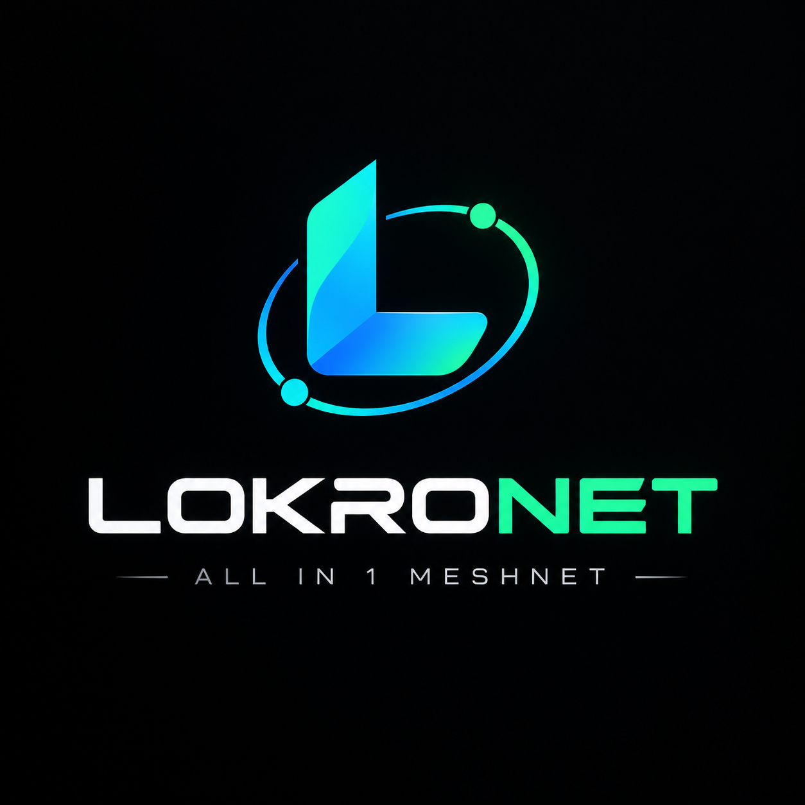

# LokroNet v0.2 – Messenger-Fokus (Mesh pausiert)



```
█    █▀▀█ █  █ █▀▀█ █▀▀█ █  █ ████ ████
█    █  █ █ █  █▀ █ █  █ ██ █ █▀▀▀  █
█▄▄▄ █▄▄█ █  █ █  █ █▄▄█ █  █ █▄▄▄  █
```

<details>
<summary>Großes ASCII-Logo (8 Zeilen, für Terminals ab 100 Spalten)</summary>

<pre>
 █████          ███████    █████   ████ ███████████      ███████                         █████   
░░███         ███░░░░░███ ░░███   ███░ ░░███░░░░░███   ███░░░░░███                      ░░███    
 ░███        ███     ░░███ ░███  ███    ░███    ░███  ███     ░░███ ████████    ██████  ███████  
 ░███       ░███      ░███ ░███████     ░██████████  ░███      ░███░░███░░███  ███░░███░░░███░   
 ░███       ░███      ░███ ░███░░███    ░███░░░░░███ ░███      ░███ ░███ ░███ ░███████   ░███    
 ░███      █░░███     ███  ░███ ░░███   ░███    ░███ ░░███     ███  ░███ ░███ ░███░░░    ░███ ███
 ███████████ ░░░███████░   █████ ░░████ █████   █████ ░░░███████░   ████ █████░░██████   ░░█████ 
░░░░░░░░░░░    ░░░░░░░    ░░░░░   ░░░░ ░░░░░   ░░░░░    ░░░░░░░    ░░░░ ░░░░░  ░░░░░░     ░░░░░  
</pre>
</details>

E2E-Messenger mit Terminal-UI + Desktop-App: Peers per 12-stelliger ID finden,
Session-Handshake mit Signatur, Nachrichten Ende-zu-Ende verschlüsselt,
Verlauf lokal geteilt zwischen TUI und Desktop.

> **Stand v0.2:** Messenger aktiv (Chat, Presence-Beacons, lokale History),
> Mesh/Tunnel pausiert. Rendezvous nur für Discovery + opake Relay-Blobs,
> **keine DB, keine Klartext-Nutzdaten auf Servern.**

## Schnellstart

```bash
# Server (Ubuntu headless):
curl -fsSL https://net.lokro.dev/install | sudo bash -s -- --server

# PC mit UI:
curl -fsSL https://net.lokro.dev/install | sudo bash -s -- --ui

# Danach (als User):
lokronet setup --rendezvous http://DEIN-SERVER:8787
lokronet beacon
lokronet chat open --id <ID|Name>   # Session-Code vergleichen!
lokronet chat send --id <ID|Name> --text "hallo"
lokronet dashboard                  # TUI mit Chat
```

Desktop-App (C#/Avalonia, gleiche Daemon-IPC wie TUI):

```powershell
cd desktop/LokroNet.Desktop
dotnet run
```

Details: [`docs/INSTALL.md`](docs/INSTALL.md), Ideen-Speicher [`docs/IDEEN.md`](docs/IDEEN.md).

## CLI (v0.2)

```powershell
lokronet setup              # ID + Keys, am Rendezvous registrieren (offline-fähig)
lokronet status             # ID, Fingerprint, Peers, Traffic
lokronet chat open --id <ID>     # E2E-Handshake (signierter X25519, Code vergleichen)
lokronet chat send --id <ID> --text "..."  # senden (direct, sonst relay)
lokronet chat sessions      # Sessions + Session-Codes
lokronet chat inbox         # Verlauf (lokal, geteilt mit Desktop)
lokronet presence           # online/offline aus Beacons
lokronet beacon             # Health-Beacon (Boot sendet auto an alle Kontakte)
lokronet dashboard          # Terminal-UI mit Chat
lokronet dashboard-web      # Browser-Check (nur Loopback)
lokronet mesh [on|off]      # pausiert – Messenger braucht nur Signaling+UDP-Direct
```

## Sicherheit in einem Satz

12-stellige ID = nur Adresse. Auth: Ed25519-Identität + signierter
Ephemeral-X25519-Handshake + manueller Session-Code-Vergleich.
Nachrichten NaCl-box (E2E), Rendezvous sieht nur Metadaten/opake Blobs.
Lokal: `~/.lokronet/` mit 0600 (History, Keys, Token).

## Struktur

```text
cmd/lokronet/          # CLI + TUI-Dashboard + Web-Dashboard
internal/identity/     # ID + Ed25519
internal/daemon/       # Backend: IPC, Chat, Presence/Beacons, signierter Handshake
internal/chat/         # E2E-Sessions (box) + lokale History (geteilt)
internal/signal/       # Rendezvous-Client/Server (Discovery + Relay, keine DB)
internal/contacts/     # Aliase + History
desktop/LokroNet.Desktop/  # C#/Avalonia-UI (gleiche IPC wie TUI)
scripts/autostart/     # Boot-Beacon (.sh + .cmd)
deploy/                # install.sh (--server/--ui), systemd
docs/                  # IDEEN.md, INSTALL.md
```
